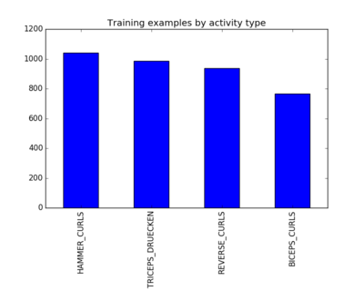
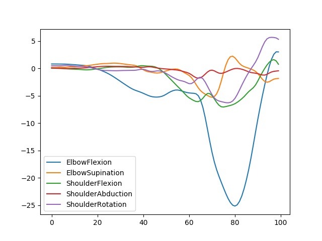

# MovCap
Capture and classify movements with NN 
## Explore dataset  
`python -c "from plot import plotLabels; print plotLabels()"`  
  

`python -c "from plot import plotActivity; print plotActivity('HAMMER_CURLS')"`  
 
## Prepare notch data  
Each notch sensor stores its data in one csv file. To put those files in an appropriate format *prepareNotchData.py* can be used. Before running the script adapt the following lines:  
```python
USERS = np.array([["User", 1], ["1", 200], ["2", 47]])  
# ["userID", number of rows userID should be attached to]
LABELS = np.array([["Label", 1], ["HAMMER_CURLS", 100], ["BICEPS_CURLS", 50], ["TRICEPS_DRUECKEN", 50], ["REVERSE_CURLS", 47]])  
# ["Label", number of rows Label should be attached to]
```  
Afterwards run `python prepareNotchData.py`  
## Train model  
Run `python activity_recognition.py` to train and test model  

## Export model to Android  
Run `python export_toAndroid.py` to freeze the model.
