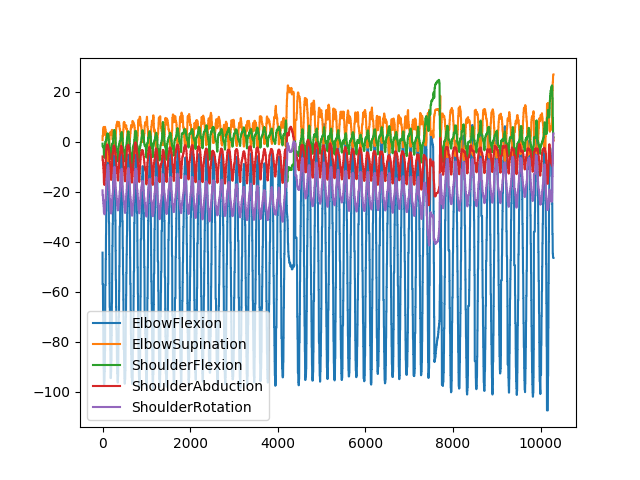
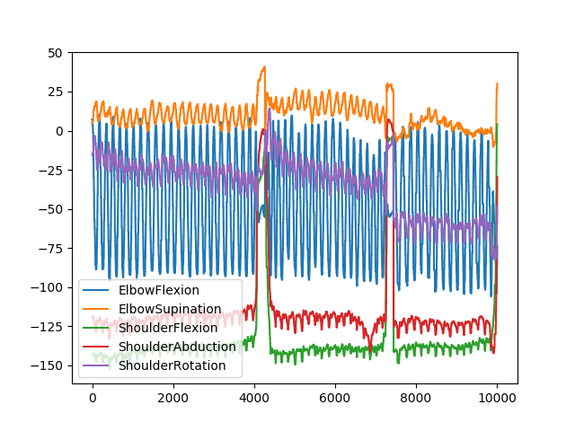
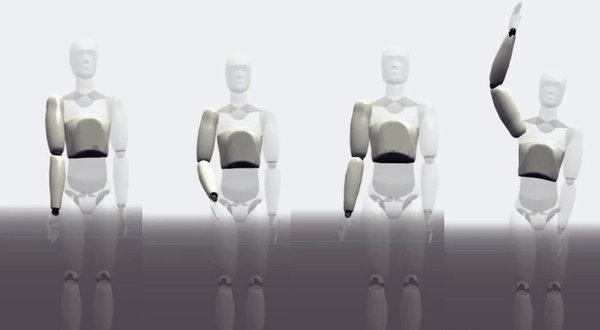
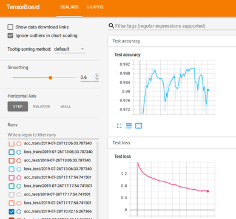

# MovCap
Capture and classify movements with NN  
## Generate data  
The data was generated with three notch sensors, see image below:  
  
  
*sensors are placed on the right arm*  
## Explore dataset  
`python -c "from plot import plotLabels; print plotLabels()"`  
  

`python -c "from plot import plotActivity; print plotActivity('HAMMER_CURLS')"`  
Hammer curls:  
  
  
Triceps:  
 
  
Four movements: Biceps curls, hammer curls, reverse curls, dumbbell tricep extension  
  
## Prepare notch data  
Angles of the notch sensors are stored in csv files. To put those files (Angles_RightElbow.csv and Angles_RightShoulder.csv) in an appropriate format *prepareNotchData.py* can be used. Before running the script adapt the following lines in *prepareNotchData.py*:  
```python
USERS = np.array([["User", 1], ["1", len(arr1)-1]])
# Set ID of user in this part of the array: ["1", len(arr1)-1]
LABELS = np.array([["Label", 1], ["TRICEPS_DRUECKEN", len(arr1)-1]])  
# Set label in this part of the array: ["TRICEPS_DRUECKEN", len(arr1)-1]])
```  
Afterwards run `python prepareNotchData.py`.  
## Train model  
Run `python activity_recognition.py` to train and test the model.  
After running the script results (accuracy, loss and graphs) are displayed on TensorBoard.  
Run `tensorboard --logdir=data/summary`  
  
  
## Export model to Android  
Run `python freezeModel.py` to freeze the model.  
Copy the generated `frozen_har.pb` into the asset folder of an android-studio project.  
To test the frozen model, run `python testFrozenModel.py`  
  
Most important part can be seen below:

```java
    private TensorFlowInferenceInterface inferenceInterface;
    private static final String MODEL_FILE = "file:///android_asset/frozen_har.pb";
    private static final String INPUT_NODE = "X";
    private static final String[] OUTPUT_NODES = {"y_pred_softmax"};
    private static final String OUTPUT_NODE = "y_pred_softmax";
    private static final long[] INPUT_SIZE = {1, 150, 5};
    private static final int OUTPUT_SIZE = 4;

    public TensorFlowClassifier(final Context context) {
        inferenceInterface = new TensorFlowInferenceInterface(context.getAssets(), MODEL_FILE);
    }

    public float[] predictProbabilities(float[] data) {
        float[] result = new float[OUTPUT_SIZE];

        try {

            inferenceInterface.feed(INPUT_NODE, data, INPUT_SIZE);
            inferenceInterface.run(OUTPUT_NODES);
            inferenceInterface.fetch(OUTPUT_NODE, result);

        } catch (Exception e){
            System.out.println("Something went wrong: "+ e);
        }
        return result;
    }
}
```  
*Note if you have problems with libandroid_tensorflow_inference_java.jar you might need to update it: https://bintray.com/google/tensorflow/tensorflow#files/org%2Ftensorflow%2Ftensorflow-android. The package is called tensorflow-android-1.9.0.aar*  
  
The screen of *HarApp* can be seen below:  
  
  
*HarApp to test neural network on android, it doesn't use notch sensors*  
## Notch App  
### Setup
Notch app called *Tutorial* can be downloaded from https://wearnotch.com/developers/docs/sdk/android/  
This app was used for further implementations. To use it, a license code needs to be added in *Tutorial/app/src/main/java/com/wearnotch/notchdemo/MainFragment.java*  
 ```java
public class MainFragment extends BaseFragment {
    private static final String DEFAULT_USER_LICENSE = "SOME_LICENSE_CODE";
}
```  
Username and password also need to be added in *build.gradle*  
```
maven {
    url 'https://wearnotch.com/maven/notch/'
    credentials {
        username 'my_username'
        password 'my_password'
    }
}
```
To get license code, username and password login to https://wearnotch.com/login/?next=/developers/
and navigate to dashboard. Hit details and press Licenses button to get a license code and Credentials for username and password.

